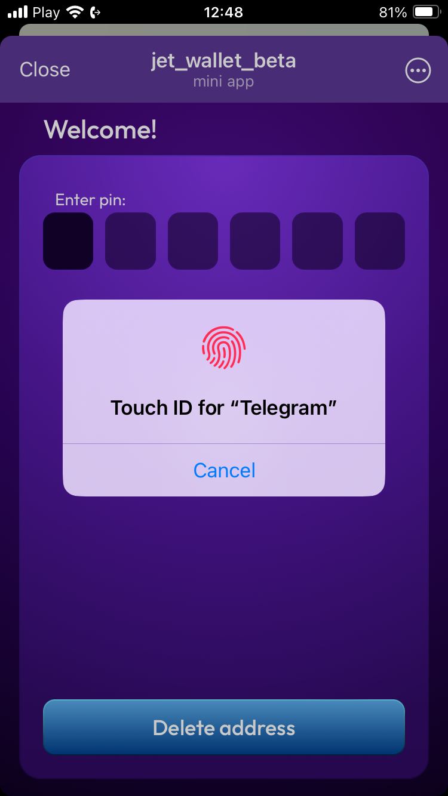
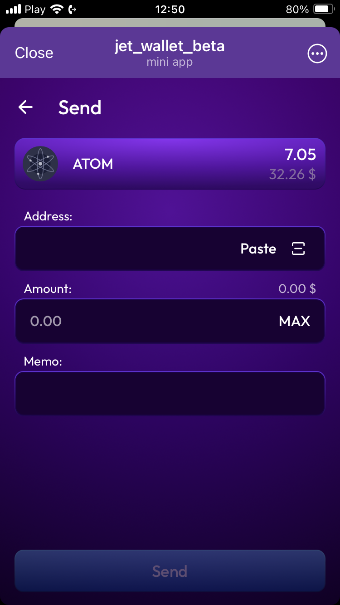
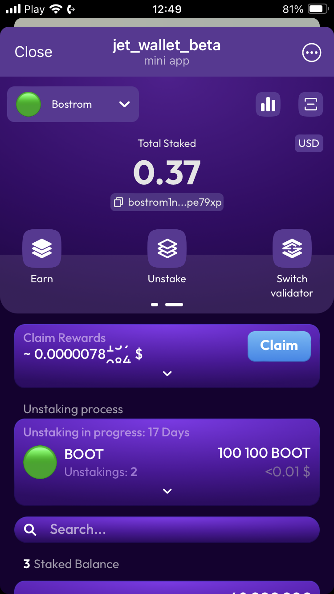
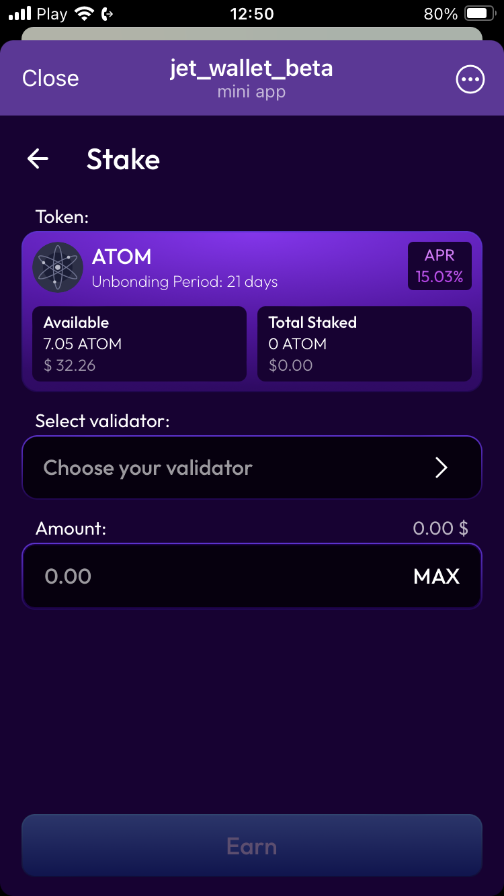

# JetWallet for Telegram


-blue)


Please be aware that this version of our digital wallet is still under development and should be used with caution. As this is a beta product, we strongly advise against storing large amounts of funds in this wallet. Consider using JetWallet as a hot wallet for small, everyday transactions. For securing larger amounts of your assets, we recommend using a more established and fully tested wallet solution.

Please note that while we make every effort to ensure the security and functionality of our wallet, we cannot guarantee complete security at this stage of development. By using this beta version, you acknowledge and agree that there may be risks involved and that you use it at your own discretion and risk.

## Description
JetWallet is a Telegram mini-app designed to manage a cryptocurrency wallet within the Cosmos ecosystem. This application allows users to create and import wallets, manage addresses, execute transactions, and participate in staking and redelegation.

## Key Features
- **Wallet Creation**: Users can create a new wallet directly within Telegram
- **Wallet Import**: Users can import existing wallets using a secret phrase or private key.
- **Address Management**: Supports managing a single address for transaction purposes.
- **Send Coins**: Enables users to send coins to other addresses within the Cosmos ecosystem.
- **Staking**: Users can stake coins to support network security and earn rewards.
- **Redelegation**: Allows for the redelegation of stakes from one validator to another without needing to unstake.
- **Unstaking**: Provides the option to unstake if users decide to stop supporting the network.

## Getting Started
1. **Add JetWallet to your Telegram** @cosmos_wallet_bot
2. **Follow the in-app instructions** to create or import your wallet.

## Screenshots

|         |         |         |         |         |
|---------|---------|---------|---------|---------|
|   |   |   |   |   |

 

## Contributing
We welcome contributions to the project. If you want to help develop JetWallet, please review the current issues in the GitHub repository or create a new issue to discuss new ideas or changes.

## Project setup
```
npm install
```

### Compiles and hot-reloads for development
```
npm run serve
```

### Compiles and minifies for production
```
npm run build
```

### Customize configuration
See [Configuration Reference](https://cli.vuejs.org/config/).
